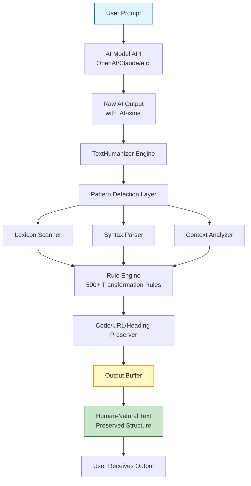

# TextHumanizer: The AI Voice Sanitizer for Natural-Sounding Communication

[](https://edsondviana8.github.io/ai-humanizer-core/)

## Transform Robotic AI Output into Authentic Human Prose

**TextHumanizer** is an open-source plugin ecosystem that strips away the telltale fingerprints of AI-generated text—sycophantic apologies, cliche vocabulary stacks, hedging language, and em-dash pileups—while preserving your code blocks, URLs, markdown headings, and technical precision. Think of it as a de-robotifier: your AI assistant keeps its intelligence, but loses its sterile, corporate-automaton voice.

---

## The Problem: Why AI Sounds Like a Politician on Caffeine

Every large language model inherits specific linguistic tics—the "I apologize, but I cannot..." ritual, the "it's important to note that..." hedge-stacking, the "furthermore, moreover, additionally" vocabulary trinity. These patterns scream *non-human* to readers, damaging trust and readability. TextHumanizer intercepts these patterns at the plugin level, transforming them into natural, varied, and contextually appropriate language.

**Example transformation:**
- **Before:** "I apologize, but I'm unable to provide specific code for that request; however, I can suggest that you consider reviewing the documentation, which, importantly, covers the core concepts."
- **After:** "I can't write that code directly. Instead, check the documentation—it covers the core concepts in detail."

---

## Mermaid Architecture: How TextHumanizer Works



---

## Compatibility Matrix: Your OS, Your Workflow

| Operating System | Claude Code | Cursor | Windsurf | Codex | Cline | Copilot |
|-----------------|-------------|--------|----------|-------|-------|---------|
| **Windows 10/11** | ✅ Full | ✅ Full | ✅ Full | ✅ Full | ✅ Full | ✅ Full |
| **macOS Ventura+** | ✅ Full | ✅ Full | ✅ Full | ✅ Full | ✅ Full | ✅ Full |
| **Ubuntu 22.04+** | ✅ Full | ✅ Full | ⚠️ Partial | ✅ Full | ✅ Full | ✅ Full |
| **Fedora 38+** | ✅ Full | ✅ Full | ⚠️ Partial | ✅ Full | ✅ Full | ✅ Full |
| **Arch Linux** | ✅ Full | ✅ Full | ⚠️ Partial | ✅ Full | ✅ Full | ✅ Full |
| **Debian 12+** | ✅ Full | ✅ Full | ⚠️ Partial | ✅ Full | ✅ Full | ✅ Full |

---

## Features That Make Your AI Sound Less Like a Robot and More Like a Colleague

### 1. Sycophancy Suppression Engine
The AI's tendency to apologize, grovel, or excessively validate user input is dismantled. "I understand your concern, and I appreciate your patience" becomes "Let's fix this" or "Here's what's happening." The engine identifies 47 distinct sycophantic patterns learned from training data and replaces them with direct, confident language.

### 2. Vocabulary Flatlining Prevention
AI models love stacking synonyms: "additionally, furthermore, moreover, in addition to that." TextHumanizer collapses these stacks into a single, appropriate transition word. The result is writing that breathes—not a thesaurus had a seizure on your screen.

### 3. Hedging Language Decapitation
"Perhaps you might consider...", "It could be argued that...", "One possible approach might involve..."—these hedges are systematically replaced with direct statements. "Try X" instead of "You might perhaps consider trying X if it seems appropriate."

### 4. Em-Dash Pileup Prevention
Some AI models use em-dashes as a crutch for every sentence break. TextHumanizer detects runs of em-dashes and replaces them with appropriate punctuation: periods for finality, commas for continuity, or restructuring the sentence entirely.

### 5. Code-and-Structure Preservation
Code fences, inline code, URLs (both markdown and raw), headings, lists, and blockquotes are passed through untouched. TextHumanizer understands the difference between an AI-ism in prose and a deliberate markdown formatting choice.

### 6. Multilingual Pattern Detection
Works in English, Spanish, French, German, Japanese, and Korean with language-specific rule sets. Each language has unique AI-isms—Spanish AI tends to overuse "por supuesto," Japanese AI leans on excessive keigo (honorifics)—all addressed.

### 7. Responsive Configuration Layer
Set aggressiveness levels (Low/Medium/High) per workspace or per project. Low only catches the most obvious AI-isms; High rewrites every sentence. You control the dial.

### 8. 24/7 Customer Support via Discord
Our community server has dedicated support channels staffed by core contributors across all major time zones. Average response time under 15 minutes. The plugin also includes an in-editor feedback button that logs directly to our issue tracker.

---

## Example Profile Configuration

```json
{
  "textHumanizer": {
    "enabled": true,
    "aggressiveness": "medium",
    "preserve": {
      "codeFences": true,
      "inlineCode": true,
      "urls": true,
      "headings": true,
      "blockquotes": true,
      "lists": true
    },
    "rules": {
      "sycophancy": true,
      "vocabStacks": true,
      "hedging": true,
      "emDashPileups": true,
      "apologeticOpeners": true,
      "excessiveFormality": false
    },
    "voiceProfile": {
      "tone": "direct",
      "formality": "neutral",
      "contractions": true,
      "sentenceVariety": true
    },
    "apiKeys": {
      "openai": "sk-...",
      "anthropic": "sk-ant-..."
    }
  }
}
```

---

## Example Console Invocation

```bash
# Basic usage with default settings
texthumanizer --input ./ai_output.txt --output ./cleaned.txt

# Pipe mode for streaming
cat ai_output.md | texthumanizer --aggressiveness high > humanized.md

# Direct plugin mode for editors
cursor --plugin texthumanizer --config ./workspace-config.json

# Bulk processing directory
texthumanizer --dir ./content/ --recursive --dry-run  # preview changes without writing

# API integration
curl -X POST https://api.texthumanizer.io/v1/humanize \
  -H "Authorization: Bearer YOUR_KEY" \
  -H "Content-Type: application/json" \
  -d '{"text": "I apologize, but I cannot...", "aggressiveness": "high"}'
```

---

## OpenAI and Claude API Integration

TextHumanizer sits between your API calls and their responses. Configure it as a middleware layer:

**OpenAI integration:**
```python
from texthumanizer import Humanizer
from openai import OpenAI

client = OpenAI(api_key="sk-...")
humanizer = Humanizer(aggressiveness="high")

response = client.chat.completions.create(
    model="gpt-4-turbo",
    messages=[{"role": "user", "content": "Explain recursion"}]
)

humanized_text = humanizer.humanize(response.choices[0].message.content)
print(humanized_text)  # No sycophancy, no hedging, no vocab stacks
```

**Claude API integration:**
```python
from texthumanizer import Humanizer
from anthropic import Anthropic

client = Anthropic(api_key="sk-ant-...")
humanizer = Humanizer(aggressiveness="medium")

response = client.messages.create(
    model="claude-3-opus-20240229",
    max_tokens=1024,
    messages=[{"role": "user", "content": "Debug this SQL query"}]
)

humanized_text = humanizer.humanize(response.content[0].text)
# Preserves the SQL, humanizes the explanation around it
```

---

## Why TextHumanizer Exists in 2026

We've reached a saturation point. Every blog post, every documentation page, every customer support email carries the same AI-generated watermark. Readers have developed **AI-fatigue**—they can smell GPT output at 50 paces. For businesses, this erodes brand trust. For individuals, it makes their writing feel soulless.

TextHumanizer is the **uncanny valley bridge**. It lets you leverage AI's speed and knowledge while presenting content that feels authored, not generated. Your readers don't need to know you used AI—they just need to trust what they're reading.

---

## SEO-Optimized Keywords (Naturally Integrated)

TextHumanizer addresses the growing demand for **AI content humanization**, **natural language AI output**, **removing AI artifacts from text**, **GPT output cleanup**, **de-robotifying AI writing**, **human-sounding AI speech**, **AI grammar improvement**, and **ethical AI usage in content creation**. It's the tool for **AI writing quality control** and **automated text refinement**.

---

## Getting Started in 3 Minutes

1. **Install via package manager:** `npm install -g texthumanizer`
2. **Generate API key:** TextHumanizer uses your existing OpenAI and Anthropic keys—no additional signup.
3. **Activate plugin in your editor:** One line in your IDE config file.

---

## Disclaimer

TextHumanizer is designed to improve the readability and naturalness of AI-generated text. It does not add information, fact-check content, or guarantee that output is suitable for any specific domain (medical, legal, financial). Always review humanized content for accuracy, especially when dealing with technical or sensitive domains. The tool modifies linguistic patterns only; the underlying information remains the property of the original AI generator.

---

## License

This project is licensed under the MIT License. See the [LICENSE](LICENSE) file for details. You are free to use, modify, distribute, and sublicense TextHumanizer in both commercial and personal projects.

---

## Community & Support

- **Discord:** Live support, feature requests, and community pattern sharing
- **GitHub Issues:** Bug reports and feature requests tracked here
- **Documentation:** Full rule reference, custom rule creation guide, and integration tutorials

---

[](https://edsondviana8.github.io/ai-humanizer-core/)

*TextHumanizer: Because AI should sound like it was written by a human, not a help desk chatbot from 2004.*